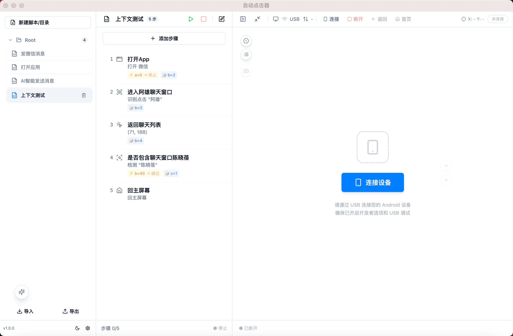

# AutoClick - 手机投屏与控制软件


AutoClick 是一款基于 Electron 的跨平台 Android 设备投屏与控制软件。支持 USB 连接手机后实时投屏、键鼠模拟交互、脚本录制与自动化执行，并集成 AI 智能操控能力（自然语言指令 → 自动执行）。



---

## 功能特性

### ✅ 已实现

| 类别 | 功能 |
| :--- | :--- |
| **设备连接** | USB 自动发现设备、连接/断开、型号/分辨率/连接方式显示 |
| **画面投屏** | scrcpy 实时视频流解码渲染、画布等比缩放自适应、窗口最小化投屏模式 |
| **交互控制** | 单击模拟手指点击、拖动模拟滑动、返回键/Home/多任务键、截图 |
| **脚本管理** | 脚本/文件夹创建、编辑、删除、树形展开、拖拽排序、导入/导出 `.js` 文件、初始上下文 |
| **步骤编辑** | 10 种步骤类型（点击/输入/滑动/长按/回主屏幕/打开App/AI/文本检测/识别点击）、步骤名称自定义、增删改查、前置条件/写入上下文 |
| **脚本执行** | 全量执行、单步执行、步骤高亮、超时控制、失败重试、手动中断、Context 条件分支 |
| **点击录制** | 可视化录制点击事件、模板列表管理（分页/编辑/删除）、AI 调用/步骤添加复用 |
| **AI 智能操控** | 自然语言指令 → LangGraph 工作流 → 自动执行；多步骤复合指令（sequence）；VLM 文本检测（checkText）；多模态视觉定位点击（visionClick）；动态工具（已录制点击模板）；历史记录 |
| **AI 模型配置** | 意图解析模型（LLM）和视觉分析模型（VLM）独立配置，支持任意 OpenAI 兼容 API |
| **系统配置** | 脚本超时时间、步骤执行间隔、最大重试次数、App 桌面扫描页数 |
| **深色主题** | 默认启用深色模式 |

### 🚧 待实现

- 中文输入支持
- 操作录制自动生成脚本
- 定时任务（Cron 表达式）
- Webhook 通知（飞书/钉钉/微信）
- 多设备同时连接
- Windows 平台打包

---

## 技术栈

| 层级 | 技术 | 版本 |
| :--- | :--- | :--- |
| 桌面容器 | Electron | ^31.1.0 |
| UI 框架 | React | ^18.3.1 |
| 类型系统 | TypeScript | ^5.5.2 |
| UI 组件库 | shadcn/ui (Radix UI + TailwindCSS) | — |
| 样式方案 | TailwindCSS | ^3.4.4 |
| 状态管理 | Zustand | ^4.5.4 |
| 构建工具 | Vite | ^5.3.2 |
| 数据库 | SQLite (TypeORM + better-sqlite3) | — |
| AI 编排 | LangGraph.js (@langchain/langgraph) | ^0.2.x |
| LLM 驱动 | @langchain/openai（OpenAI 兼容 API） | ^0.3.x |
| 视觉模型 | 智谱 GLM-4V / 任意多模态 API | HTTP fetch |
| 投屏解码 | @yume-chan/scrcpy-decoder-tinyh264 | ^2.1.0 |
| 图标库 | lucide-react | ^0.400.0 |
| 打包工具 | electron-builder | ^24.13.3 |

---

## 快速开始

### 环境要求

- **Node.js** >= 18
- **npm** >= 9
- **Android 设备**（USB 调试已开启）
- **ADB**（Android Debug Bridge，需在系统 PATH 中）

### 安装

```bash
# 克隆项目
git clone <repo-url>
cd AutoClick

# 安装依赖
npm install

# 重新编译原生模块
npm run postinstall
```

### 开发

```bash
# 同时启动渲染进程（Vite HMR）和主进程
npm run dev
```

启动后会自动打开 Electron 窗口，连接 Android 设备后即可使用。

### 构建与打包

```bash
# 构建生产版本
npm run build

# 打包为 macOS DMG
npm run package
```

---

## 项目结构

```
AutoClick/
├── src/
│   ├── main/                       # 主进程（Node.js）
│   │   ├── index.ts                # 入口：窗口创建 + IPC 注册
│   │   ├── config.ts               # 配置管理（LLM/VLM/Workflow）
│   │   ├── common/                 # 公共类型定义
│   │   ├── ai-agent/               # AI 解析模块（LangGraph 子图）
│   │   │   ├── graph.ts            #   StateGraph 定义
│   │   │   ├── nodes/              #   工作流节点（意图解析/步骤转换）
│   │   │   ├── services/           #   LLM/VLM API 封装
│   │   │   ├── tools/              #   动态工具（截图/文本检测/步骤转换）
│   │   │   └── prompts/            #   意图解析提示词
│   │   ├── ai-assistant/           # AI 编排模块（协调解析+执行）
│   │   │   ├── index.ts            #   IPC Handler 注册
│   │   │   └── execute-ai-workflow.ts # 工作流执行器
│   │   ├── script/                 # 脚本管理模块
│   │   │   ├── services/           #   业务逻辑层（ScriptService）
│   │   │   ├── entities/           #   数据实体（TypeORM）
│   │   │   ├── repositories/       #   仓储层
│   │   │   └── ipc/                #   IPC 处理器
│   │   ├── script-engine/          # 脚本执行引擎
│   │   │   ├── step-executor.ts    #   步骤执行器（10种步骤类型）
│   │   │   ├── adb-executor.ts     #   ADB 命令执行器
│   │   │   └── ...                 #   队列/上下文/校验
│   │   ├── screen-mirror/          # 投屏管理
│   │   │   ├── adb.ts              #   ADB 命令行封装
│   │   │   ├── control.ts          #   触控/按键控制
│   │   │   └── bridge.mjs          #   scrcpy 视频流子进程
│   │   └── record-script/          # 点击录制模块
│   ├── preload/
│   │   └── index.ts                # 预加载脚本（contextBridge）
│   ├── renderer/                   # 渲染进程（React）
│   │   └── src/
│   │       ├── App.tsx             # 应用根组件
│   │       ├── components/         # UI 组件
│   │       │   ├── ScriptPanel.tsx  #   脚本管理面板
│   │       │   ├── StepPanel.tsx    #   步骤列表面板
│   │       │   ├── MirrorPanel.tsx  #   投屏面板
│   │       │   ├── AiFloatingAssistant.tsx # AI 助手浮动按钮
│   │       │   ├── NewStepDialog.tsx #   添加/编辑步骤弹窗
│   │       │   └── ...             #   其他组件
│   │       ├── stores/             # Zustand 状态管理
│   │       │   ├── scriptStore.ts
│   │       │   └── deviceStore.ts
│   │       └── globals.css         # 全局样式 + 主题变量
│   └── types/
├── docs/                           # 项目文档
│   ├── 需求.md                     #   产品需求文档
│   ├── 架构.md                     #   系统架构设计
│   ├── 界面.md                     #   UI 设计文档
│   ├── 开发计划.md                 #   开发迭代计划
│   ├── 开发日志/                   #   迭代开发日志
│   └── 详细设计/                   #   详细设计文档
├── resources/                      # 应用图标等静态资源
├── release/                        # 打包输出
└── package.json
```

---

## 使用指南

### 连接设备

1. 通过 USB 连接 Android 设备
2. 确保已开启 **USB 调试**（开发者选项中）
3. 点击 AutoClick 中的 **"连接"** 按钮
4. 连接成功后自动显示投屏画面

### 管理脚本

1. 点击 **"+ 新建脚本/目录"** 创建脚本或文件夹
2. 在脚本中添加步骤（支持 10 种步骤类型）
3. 选中步骤后可编辑或删除
4. 支持拖拽排序、导入/导出 `.js` 格式的脚本文件
5. 可为脚本设置**初始上下文**，步骤支持**前置条件**和**写入上下文**

### 步骤类型

| 类型 | 图标 | 说明 |
| :--- | :--- | :--- |
| 点击 | 🖱 | 在指定坐标处模拟点击 |
| 输入 | ⌨ | 输入文本内容 |
| 滑动 | ↕ | 按方向滑动屏幕 |
| 长按 | 👆 | 在指定坐标处长按 |
| 回主屏幕 | 🏠 | 返回桌面（KEYCODE_HOME） |
| 打开App | 🧩 | 通过名称搜索并打开应用 |
| AI | ✨ | 自然语言描述，AI 自动解析为子步骤执行 |
| 文本检测 | 🔍 | 检测屏幕上是否包含指定文本 |
| 识别点击 | 👁 | 通过视觉识别目标位置并点击 |

### AI 智能操控

1. 点击投屏区域右下角的 **✨ AI 按钮** 打开输入面板
2. 输入自然语言指令，如：
   - `"打开微信"`
   - `"点击钱包"`
   - `"返回桌面"`
   - `"打开微信，进入某某聊天，输入 Hello，发送"`
3. AI 自动解析意图 → 执行操作 → 显示步骤进度
4. 执行中可双击 AI 按钮停止
5. 可在 **系统设置 → 意图解析模型 / 视觉分析模型** 中配置 API

### 执行脚本

1. 选中脚本后点击 **▶ 运行** 按钮全量执行
2. 或选中单个步骤点击运行单独执行
3. 执行过程中当前步骤 **黄色高亮** 显示 + 旋转加载图标
4. 可随时点击 **⬜ 停止** 中断执行

### 系统配置

在 **系统设置** 中可配置：
- **脚本执行**：步骤间隔、脚本超时、重试次数、App 扫描页数
- **意图解析模型（LLM）**：API Key、地址、模型名（如 deepseek-chat、gpt-4o-mini）
- **视觉分析模型（VLM）**：API Key、地址、模型名（如 glm-4v、gpt-4o）、截图参数

---

## 开发日志

各迭代开发详情记录在 [docs/开发日志/](docs/开发日志/) 目录中。

| 日志 | 内容 |
| :--- | :--- |
| [开发日志1](docs/开发日志/开发日志1.md) | 需求讨论、架构设计、Iteration 1-2 |
| [开发日志2](docs/开发日志/开发日志2.md) | UI 实现、Figma 对接 |
| [开发日志3-4](docs/开发日志/开发日志3.md) | 脚本管理 Service 层设计与实现 |
| [开发日志5](docs/开发日志/开发日志5.md) | 投屏管理实现 |
| [开发日志6](docs/开发日志/开发日志6.md) | 脚本执行引擎实现 |
| [开发日志7](docs/开发日志/开发日志7.md) | Settings 实现、UI 调整 |
| [开发日志8](docs/开发日志/开发日志8.md) | 打包测试、Bug 修复 |
| [开发日志9](docs/开发日志/开发日志9.md) | AI 智能操控迭代 15-17 |
| [开发日志10](docs/开发日志/开发日志10.md) | AI 重构、多步骤、文本检测、动态工具 |
| [开发日志11](docs/开发日志/开发日志11.md) | Context 全链路支持、UI 优化 |
| [开发日志12](docs/开发日志/开发日志12.md) | 屏幕文本检测步骤 checkText |
| [开发日志13](docs/开发日志/开发日志13.md) | 图像识别点击步骤 visionClick |

---

## 许可

[MIT](LICENSE)
