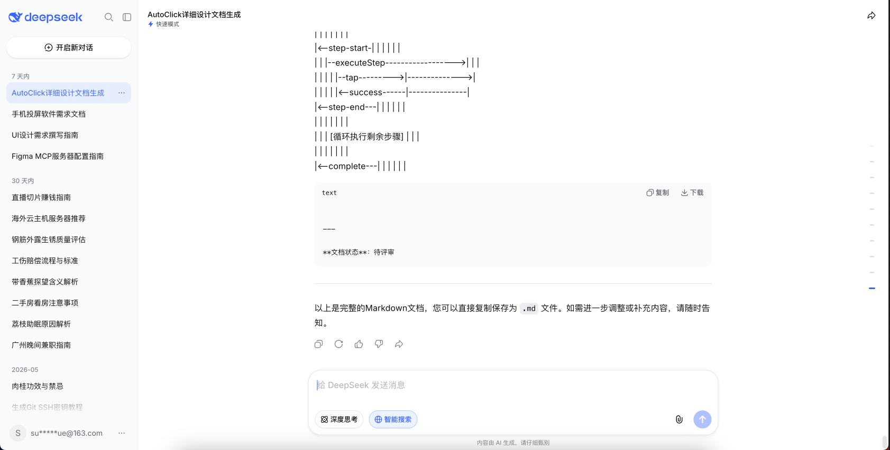
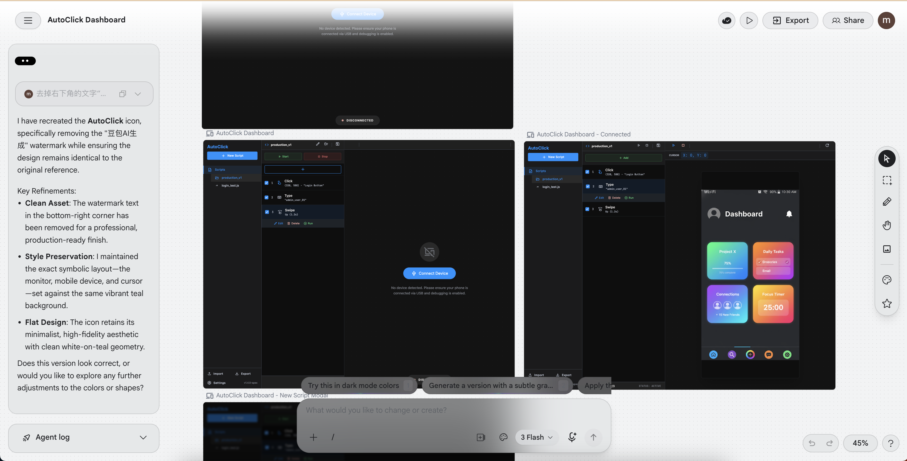
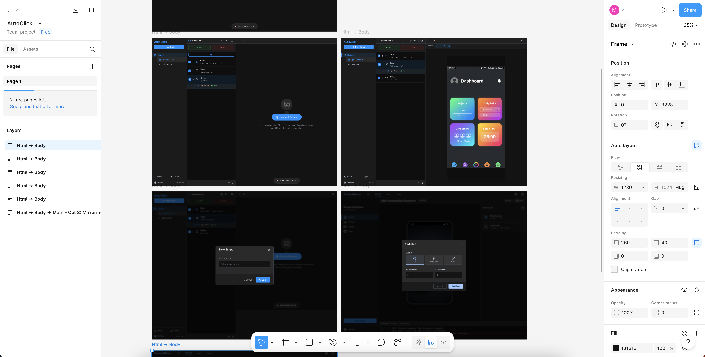
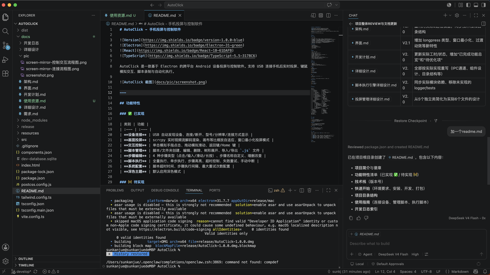
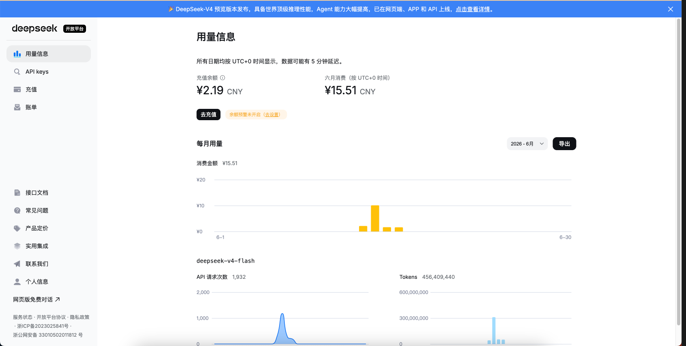

# 概览

用AI写一款应用【手机投屏与控制】，目的是想试一下AI到底有多强大，如何驾驭它。未来，是它会干掉我，还是它会为我所用。

## 项目初期

有个大概想法，从需求开始->架构设计->界面设计->功能设计->开发计划，把想要的功能大概描述一下，经过多轮对话，确定所有的细节，生成对应的文档

## 界面设计阶段

用Google的Stitch工具，提供需求文档，生成初期的界面，可以理解是原型+设计，再根据需求做一些细节的调整，直到满足需求为止

## 导入到Figma

从Stitch导入到Figma，为了下一步开发使用

## 开发编码阶段

配置Figma的MCP Server

安装DeepSeek开发助手，VS Code版本的

最后，可以开始Vibe Coding，按照开发计划，一个功能点一个迭代开发

## 测试验证

一个阶段一个功能点测试，测试通过之后，提交代码

## 总结

本项目开发，大概的流程是按照公司项目的形式进行的，并不是个人项目那种一句话告诉AI去生成应用。

主要目的是为了验证，AI写代码是否可控，可靠。

前期需求确认、架构设计、UI设计都是按照公司流程走，基本上理清楚之后才开始进入编码阶段。甚至最前期还做了Demo，验证过相关的库和实现方案。

开发前期，先是生成好开发计划，类似于公司的项目管理。有了这个才开始进入编码阶段，按照每个阶段产出哪些功能，验证通过后才进行下一个阶段，这样可以做到比较可控。每个阶段提交一个可用的功能，如果有bug也好及时修复。

编码阶段基本都是按照开发计划进行，偶尔会有一些小的改动穿插其中，总体的流程是没有改变的。可以从开发日志（doc）和代码的提交日志（commit）里面看的出。每个阶段都会有相关的Vibe Coding日志记录和代码提交日志，特别是代码提交日志，把控的细一点，开发过程中，如果AI改出问题了，可以很方便的回滚代码。另外，分阶段完成，每个阶段代码量也相对比较少，方便Code Review，可及时做一些重构，以便后期如果项目太大之后，逼不得已需要人为介入修改的时候，能够读懂，可以人工接手，总的来说就是写出可维护的代码。这个非常关键。

总体感觉，非常可行。

## 使用账单

使用不到20元，总token数456,409,440

DeepSeep费用真的足够便宜，开发体验感觉挺不错，功能基本都能完成了，比预期的好，很值得。需求调研设计阶段大概花了1天，开发编码阶段大概总共就花了2天，总共算3天时间吧。

