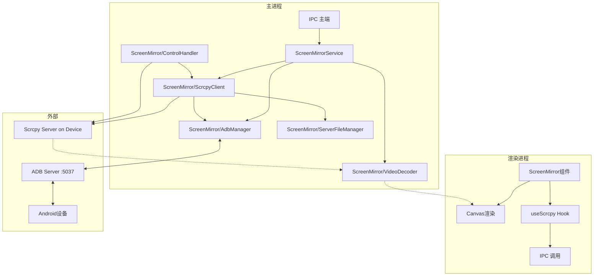

# AutoClick - 服务层设计：投屏管理 Service（@yume-chan/scrcpy 方案）

---

## 1. 概述

### 1.1 设计目标
为 AutoClick 设计投屏管理服务层，基于 `@yume-chan/scrcpy` 生态系统实现 Android 设备的屏幕镜像与远程控制功能，与脚本执行引擎深度集成。

### 1.2 服务定位
- **运行环境**：Electron 主进程（Node.js） + 渲染进程（画面渲染）
- **服务名称**：`ScreenMirrorService`

---

## 2. 技术选型

### 2.1 核心依赖包

| 依赖包 | 版本 | 说明 |
| :--- | :--- | :--- |
| `@yume-chan/adb` | ^2.6.0 | ADB 协议核心实现 |
| `@yume-chan/adb-scrcpy` | ^2.3.2 | ADB 与 Scrcpy 集成层 |
| `@yume-chan/adb-server-node-tcp` | ^2.5.2 | Node.js TCP 连接 ADB Server |
| `@yume-chan/fetch-scrcpy-server` | ^1.0.0 | Scrcpy Server 文件获取 |
| `@yume-chan/scrcpy` | ^2.3.0 | Scrcpy 协议核心 |
| `@yume-chan/scrcpy-decoder-tinyh264` | ^2.1.0 | H.264 视频解码器 |

### 2.2 选型理由

| 考量点 | 说明 |
| :--- | :--- |
| **TypeScript 原生支持** | 全链路类型安全 |
| **Electron 兼容性** | 官方明确支持 Electron 环境 |
| **协议版本支持** | 支持 Scrcpy 协议 v1.15 ~ v3.2，与官方服务器兼容 |
| **模块化设计** | 各包职责清晰，可按需引入 |
| **双解码方案** | TinyH264 软件解码 + WebCodecs 硬解码（可选扩展） |
| **版本稳定性** | v2.x 系列已成熟稳定，社区验证充分 |

### 2.3 依赖包职责说明

 @yume-chan/adb-server-node-tcp │
│ ADB Server TCP 连接（Node.js net 模块） │
└─────────────────────────────────────────────────────────────────┘
│
▼
┌─────────────────────────────────────────────────────────────────┐
│ @yume-chan/adb │
│ ADB 协议核心（设备通信） │
└─────────────────────────────────────────────────────────────────┘
│
▼
┌─────────────────────────────────────────────────────────────────┐
│ @yume-chan/adb-scrcpy │
│ ADB 与 Scrcpy 集成层（启动服务、管理连接） │
└─────────────────────────────────────────────────────────────────┘
│
▼
┌──────────────────────────────┬──────────────────────────────────┐
│ @yume-chan/scrcpy │ @yume-chan/scrcpy-decoder-* │
│ Scrcpy 协议核心 │ 视频解码器 │
└──────────────────────────────┴──────────────────────────────────┘

---

## 3. 目录结构

src/main/
├── ScreenMirror/ # 投屏模块根目录（主进程）
│ ├── index.ts # 模块入口，统一导出
│ ├── AdbManager.ts # ADB 连接管理
│ ├── ScrcpyClient.ts # Scrcpy 客户端封装
│ ├── VideoDecoder.ts # 视频解码封装（TinyH264）
│ ├── ControlHandler.ts # 触摸/按键控制
│ ├── ServerFileManager.ts # Scrcpy Server 文件管理
│ ├── types.ts # 投屏相关类型定义
│ └── ipc.ts # 投屏相关 IPC 通道注册
│ └── ScreenMirrorService.ts # 投屏服务主类（对外暴露，引用 ScreenMirror 模块）
└── ...其他目录

src/renderer/
├── components/
│ └── ScreenMirror/
│ ├── ScreenMirror.tsx # 投屏画布组件
│ └── useScreenStream.ts # 屏幕流 Hook
└── hooks/
└── useScrcpy.ts # 投屏交互 Hook

---

## 4. 架构设计

### 4.1 整体架构图

### 4.2 连接流程图

### 4.3 控制交互流程图

## 5. 模块详细设计

### 5.1 ADB 连接管理（AdbManager）

| 属性 | 说明 |
| :--- | :--- |
| **文件位置** | `src/main/ScreenMirror/AdbManager.ts` |
| **职责** | 管理与 ADB Server 的连接，设备扫描与认证 |
| **依赖** | `@yume-chan/adb-server-node-tcp`, `@yume-chan/adb` |

**核心方法**：

| 方法 | 参数 | 返回值 | 说明 |
| :--- | :--- | :--- | :--- |
| `connect()` | 无 | `Promise<void>` | 连接本地 ADB Server（127.0.0.1:5037） |
| `disconnect()` | 无 | `Promise<void>` | 断开 ADB Server 连接 |
| `getDevices()` | 无 | `Promise<AdbDevice[]>` | 获取已连接设备列表 |
| `getDevice(serial)` | `string` | `Promise<AdbDevice>` | 获取指定设备实例 |
| `isDeviceAuthorized(serial)` | `string` | `Promise<boolean>` | 检查设备授权状态 |
| `getDeviceInfo(serial)` | `string` | `Promise<DeviceInfo>` | 获取设备详细信息 |

**状态管理**：

| 状态 | 类型 | 说明 |
| :--- | :--- | :--- |
| `isConnected` | `boolean` | ADB Server 连接状态 |
| `currentDevice` | `AdbDevice | null` | 当前选中的设备 |

---

### 5.2 Scrcpy Server 文件管理（ServerFileManager）

| 属性 | 说明 |
| :--- | :--- |
| **文件位置** | `src/main/ScreenMirror/ServerFileManager.ts` |
| **职责** | 管理 Scrcpy Server JAR 文件的下载、缓存与推送 |
| **依赖** | `@yume-chan/fetch-scrcpy-server` |

**核心方法**：

| 方法 | 参数 | 返回值 | 说明 |
| :--- | :--- | :--- | :--- |
| `getServerVersion()` | 无 | `string` | 获取当前 Server 版本 |
| `ensureServerFile()` | 无 | `Promise<string>` | 确保 Server 文件存在（下载/缓存），返回本地路径 |
| `pushToDevice(adb, serial)` | `Adb, string` | `Promise<void>` | 推送 Server 文件到设备 |
| `getServerPath(serial)` | `string` | `string` | 获取设备上的 Server 路径 |
| `checkServerExists(serial)` | `string` | `Promise<boolean>` | 检查设备上 Server 文件是否存在 |
| `removeFromDevice(serial)` | `string` | `Promise<void>` | 从设备移除 Server 文件 |

**缓存策略**：

| 配置项 | 默认值 | 说明 |
| :--- | :--- | :--- |
| `cacheDir` | `app.getPath('userData')/scrcpy-server` | 本地缓存目录 |
| `cacheTTL` | 7 天 | 缓存有效期 |
| `serverRepo` | `https://github.com/Genymobile/scrcpy/releases` | Server 下载源 |

---

### 5.3 Scrcpy 客户端（ScrcpyClient）

| 属性 | 说明 |
| :--- | :--- |
| **文件位置** | `src/main/ScreenMirror/ScrcpyClient.ts` |
| **职责** | 启动 Scrcpy Server，管理视频/音频/控制流 |
| **依赖** | `@yume-chan/adb-scrcpy`, `@yume-chan/scrcpy` |

**核心方法**：

| 方法 | 参数 | 返回值 | 说明 |
| :--- | :--- | :--- | :--- |
| `start(options)` | `ScrcpyOptions` | `Promise<ScrcpySession>` | 启动 Scrcpy 会话 |
| `stop()` | 无 | `Promise<void>` | 停止会话并清理资源 |
| `getVideoStream()` | 无 | `ReadableStream<VideoPacket>` | 获取视频流 |
| `getController()` | 无 | `ScrcpyController` | 获取控制器（发送触摸/按键） |
| `getClipboardStream()` | 无 | `ReadableStream<ClipboardEvent>` | 获取剪贴板同步流 |
| `isRunning()` | 无 | `boolean` | 会话是否运行中 |

**会话状态**：

| 状态 | 说明 |
| :--- | :--- |
| `idle` | 空闲，未启动 |
| `starting` | 正在启动 |
| `running` | 运行中 |
| `stopping` | 正在停止 |
| `error` | 错误状态 |

---

### 5.4 视频解码器（VideoDecoder）

| 属性 | 说明 |
| :--- | :--- |
| **文件位置** | `src/main/ScreenMirror/VideoDecoder.ts` |
| **职责** | 解码 H.264 视频流并渲染到 Canvas |
| **依赖** | `@yume-chan/scrcpy-decoder-tinyh264` |

**核心方法**：

| 方法 | 参数 | 返回值 | 说明 |
| :--- | :--- | :--- | :--- |
| `init(options)` | `DecoderOptions` | `Promise<void>` | 初始化解码器 |
| `decode(packet)` | `VideoPacket` | `Promise<VideoFrame | null>` | 解码视频包 |
| `getRenderer()` | 无 | `HTMLCanvasElement` | 获取渲染 Canvas 元素 |
| `render(frame)` | `VideoFrame` | `void` | 渲染视频帧 |
| `destroy()` | 无 | `void` | 释放资源 |
| `getStats()` | 无 | `DecoderStats` | 获取解码统计信息 |

**解码器配置**：

| 参数 | 类型 | 默认值 | 说明 |
| :--- | :--- | :--- | :--- |
| `decoderType` | `'tinyh264' | 'webcodecs'` | `tinyh264` | 解码器类型 |
| `maxWidth` | `number` | `1080` | 最大解码宽度 |
| `maxHeight` | `number` | `1920` | 最大解码高度 |
| `fps` | `number` | `30` | 目标帧率 |
| `enableStats` | `boolean` | `false` | 启用性能统计 |

**配置注意**：TinyH264 仅支持 H.264 Baseline Profile Level 4，需通过 `codecOptions` 限制设备编码参数。

---

### 5.5 控制处理器（ControlHandler）

| 属性 | 说明 |
| :--- | :--- |
| **文件位置** | `src/main/ScreenMirror/ControlHandler.ts` |
| **职责** | 封装设备控制指令（触摸、按键、文字输入） |
| **依赖** | ScrcpyClient 的 controller 实例 |

**核心方法**：

| 方法 | 参数 | 返回值 | 说明 |
| :--- | :--- | :--- | :--- |
| `tap(x, y)` | `number, number` | `Promise<void>` | 模拟点击 |
| `doubleTap(x, y)` | `number, number` | `Promise<void>` | 模拟双击 |
| `longPress(x, y, duration?)` | `number, number, number` | `Promise<void>` | 模拟长按 |
| `swipe(x1, y1, x2, y2, duration)` | `number, number, number, number, number` | `Promise<void>` | 模拟滑动 |
| `pressBack()` | 无 | `Promise<void>` | 按下返回键 |
| `pressHome()` | 无 | `Promise<void>` | 按下 Home 键 |
| `pressAppSwitch()` | 无 | `Promise<void>` | 按下多任务键 |
| `pressVolumeUp()` | 无 | `Promise<void>` | 音量+ |
| `pressVolumeDown()` | 无 | `Promise<void>` | 音量- |
| `pressPower()` | 无 | `Promise<void>` | 电源键 |
| `inputText(text)` | `string` | `Promise<void>` | 输入文字 |
| `scroll(x, y, distance)` | `number, number, number` | `Promise<void>` | 模拟滚轮 |
| `setScreenPowerMode(mode)` | `'normal' | 'off'` | `Promise<void>` | 设置屏幕电源模式 |
| `expandNotificationPanel()` | 无 | `Promise<void>` | 展开通知栏 |
| `collapseNotificationPanel()` | 无 | `Promise<void>` | 收起通知栏 |

**触摸事件类型**：

| 事件类型 | 说明 |
| :--- | :--- |
| `ACTION_DOWN` | 按下 |
| `ACTION_UP` | 抬起 |
| `ACTION_MOVE` | 移动 |
| `ACTION_CANCEL` | 取消 |

---

### 5.6 类型定义（types.ts）

| 属性 | 说明 |
| :--- | :--- |
| **文件位置** | `src/main/ScreenMirror/types.ts` |
| **职责** | 定义投屏模块所有 TypeScript 类型 |

**主要类型**：

| 类型名称 | 说明 |
| :--- | :--- |
| `DeviceInfo` | 设备信息 |
| `ScrcpySession` | 投屏会话信息 |
| `ScrcpyOptions` | Scrcpy 启动选项 |
| `DecoderOptions` | 解码器配置选项 |
| `DecoderStats` | 解码统计信息 |
| `ControlCommand` | 控制指令类型 |
| `ErrorCode` | 错误代码枚举 |

---

### 5.7 IPC 通道注册（ipc.ts）

| 属性 | 说明 |
| :--- | :--- |
| **文件位置** | `src/main/ScreenMirror/ipc.ts` |
| **职责** | 注册投屏相关的 IPC 通道 |

**注册的 IPC 通道**：

| 通道名 | 类型 | 说明 |
| :--- | :--- | :--- |
| `scrcpy:connect` | handle | 连接设备并启动投屏 |
| `scrcpy:disconnect` | handle | 断开投屏 |
| `scrcpy:getDevices` | handle | 获取设备列表 |
| `scrcpy:tap` | handle | 模拟点击 |
| `scrcpy:swipe` | handle | 模拟滑动 |
| `scrcpy:back` | handle | 模拟返回键 |
| `scrcpy:home` | handle | 模拟 Home 键 |
| `scrcpy:text` | handle | 输入文字 |
| `scrcpy:frame` | send | 视频帧推送 |
| `scrcpy:connected` | send | 连接成功事件 |
| `scrcpy:disconnected` | send | 断开事件 |
| `scrcpy:error` | send | 错误事件 |

---

### 5.8 模块入口（index.ts）

| 属性 | 说明 |
| :--- | :--- |
| **文件位置** | `src/main/ScreenMirror/index.ts` |
| **职责** | 统一导出投屏模块的所有公共接口 |

**导出内容**：

| 导出项 | 类型 | 说明 |
| :--- | :--- | :--- |
| `ScreenMirrorService` | class | 投屏服务主类 |
| `AdbManager` | class | ADB 连接管理 |
| `ScrcpyClient` | class | Scrcpy 客户端 |
| `VideoDecoder` | class | 视频解码器 |
| `ControlHandler` | class | 控制处理器 |
| `ServerFileManager` | class | Server 文件管理 |
| `registerScrcpyIpcHandlers` | function | 注册 IPC 处理器 |
| `*` | types | 所有类型定义 |

---

### 5.9 投屏服务主类（ScreenMirrorService）

| 属性 | 说明 |
| :--- | :--- |
| **文件位置** | `src/main/services/ScreenMirrorService.ts` |
| **职责** | 对外暴露的投屏服务统一入口，协调各模块工作 |

**核心方法**：

| 方法 | 参数 | 返回值 | 说明 |
| :--- | :--- | :--- | :--- |
| `connect(serial?, options?)` | `string?, ScrcpyOptions?` | `Promise<DeviceInfo>` | 连接设备并启动投屏 |
| `disconnect()` | 无 | `Promise<void>` | 断开投屏 |
| `getDevices()` | 无 | `Promise<Device[]>` | 获取设备列表 |
| `tap(x, y)` | `number, number` | `Promise<void>` | 模拟点击 |
| `swipe(x1, y1, x2, y2, duration)` | 参数 | `Promise<void>` | 模拟滑动 |
| `pressBack()` | 无 | `Promise<void>` | 模拟返回键 |
| `pressHome()` | 无 | `Promise<void>` | 模拟 Home 键 |
| `inputText(text)` | `string` | `Promise<void>` | 输入文字 |
| `updateOptions(options)` | `ScrcpyOptions` | `Promise<void>` | 更新投屏配置 |
| `getStatus()` | 无 | `ConnectionStatus` | 获取当前连接状态 |
| `on(event, callback)` | `string, Function` | `void` | 事件监听 |

---